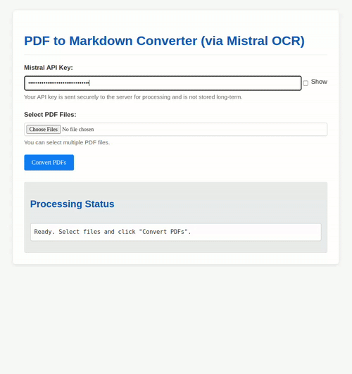

# PDF OCR Pipeline to Markdown using Mistral AI

This is a workflow to automate the conversion of PDFs to markdown using the Mistral AI OCR API. It extracts text and images from PDFs and organizes the output into structured markdown documents with images properly linked using Obsidian-style wikilinks.

> **New!!**: There’s now a web app where you can upload PDFs, preview the output, and download the Markdown files—no setup required. Try it here: https://markdownify.up.railway.app/

Want to self-host it? Check the [Local Web App](#option-2-local-web-app) section.

Prefer working in a python notebook? There's also a Jupyter Notebook version—the original version of this project. See the [Jupyter Notebook](#option-3-jupyter-notebook) section for more details.

## Features

- **Batch processing:** Place multiple PDFs in the input folder and process them automatically.
- **Text extraction:** Converts scanned PDFs into structured markdown format while preserving document hierarchy.
- **Image extraction:** Saves images separately and links them in the markdown using Obsidian-compatible `![[image-name]]` format.
- **Automatic organization:** Each processed PDF gets its own output folder with the markdown and images.
- **OCR caching:** Saves the OCR response as JSON to avoid redundant API calls.
- **Notebook mode:** Running step-by-step OCR processing in a Jupyter Notebook.

Contributions to improve compatibility with different Obsidian setups are welcome!

## Option 1: Hosted Web App

https://markdownify.up.railway.app/

**Usage:**



## Option 2: Local Web App

```sh
pip install -r requirements.txt
python app.py
```
Then open your browser at `http://localhost:5000/`

## Option 3: Jupyter Notebook

### Installation

Ensure you have Python 3.9+. Then install dependencies:

```sh
pip install mistralai jupyter python-dotenv
```

### Usage
#### 1. Set Up API Key

Before running the notebook, get your free API key from [Mistral's API Key Console](https://console.mistral.ai/api-keys). It's free.

Edit the `env.example` with your key, rename it to `.env` and you're good to go.

Or set it manually:

```sh
export MISTRAL_API_KEY='your_api_key_here'  # For Linux/macOS
set MISTRAL_API_KEY='your_api_key_here'    # For Windows
```

#### 2. Open the Notebook

```sh
jupyter notebook pdf-markdown-ocr.ipynb
```

Or open the [Notebook](pdf-markdown-ocr.ipynb) file directly in your IDE.

#### 3. Place PDFs in pdfs_to_process

Before first use, create a `pdfs_to_process` folder in the project directory and drop your PDFs in there.

#### 4. Run the Notebook

Go cell by cell and make sure everything runs as expected.

#### 5. Output Structure
Each processed PDF gets its own folder inside `ocr_output`, structured like this:

```
ocr_output/
  ├── MyDocument/
  │   ├── output.md            # Extracted markdown with wikilinks
  │   ├── ocr_response.json    # Raw OCR response (for reuse)
  │   ├── images/
  │   │   ├── MyDocument_img_1.jpeg
  │   │   ├── MyDocument_img_2.jpeg
pdfs-done/
  ├── MyDocument.pdf  # Moved here after OCR completion
```

#### 6. Move Output to Obsidian Vault

Move the generated `output.md` file into your **Obsidian vault** and also move the images to your attachments folder.

**Heads up!**: For now, Obsidian must be configured to support ![[image-name]] style links. If your setup is different, the script might not work as-is. Feel free to fork and tweak it.

### How It Works
1. The notebook scans `pdfs_to_process` for PDFs.
2. Each PDF is uploaded to Mistral AI for OCR processing.
3. The text is extracted and saved as markdown (`output.md`).
4. Images are extracted, saved in a subfolder, and referenced in the markdown using `![[image-name]]`.
5. The original PDF is moved to `pdfs-done` to avoid duplicate processing.
6. The full OCR response is saved as JSON for later use.

