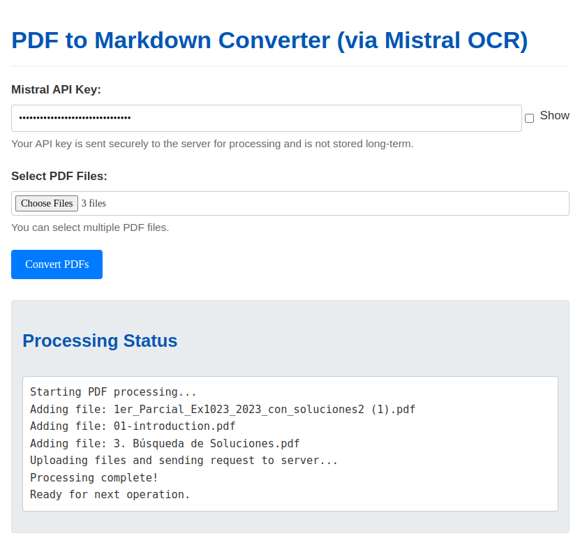

# PDF OCR Pipeline to Markdown using Mistral AI

This is a workflow to automate the conversion of PDFs to markdown using the Mistral AI OCR API. It extracts text and images from PDFs and organizes the output into structured markdown documents with images properly linked using Obsidian-style wikilinks.

> **New!!**: Now there is a Web Aplication that lets you upload your PDFs and get the markdown files, and even preview them before downloading anything. Check it here: https://markdownify.up.railway.app/

>If you want to host it yourself, check the [Web App](#web-app) section.

>Another alternative is using the **Jupyter Notebook (`.ipynb`)**. Which was the first version of this project. Check the [Usage](#usage) section for more information about it.

## Features

- **Batch processing:** Place multiple PDFs in the input folder and process them automatically.
- **Text extraction:** Converts scanned PDFs into structured markdown format while preserving document hierarchy.
- **Image extraction:** Saves images separately and links them in the markdown using Obsidian-compatible `![[image-name]]` format.
- **Automatic organization:** Each processed PDF gets its own output folder with the markdown and images.
- **OCR caching:** Saves the OCR response as JSON to avoid redundant API calls.
- **Notebook-based option:** Running step-by-step OCR processing in a Jupyter Notebook.
- Contributions to improve compatibility with different Obsidian setups are welcome!

## Option 1: Hosted Web App

https://markdownify.up.railway.app/

**Usage:**





## Option 1: Jupyter Notebook

### Installation
Ensure you have Python 3.9+ and Jupyter installed, then install dependencies:

```sh
pip install mistralai jupyter python-dotenv
```

### Usage
#### 1. Set Up API Key

Before running the notebook, you need to set up a free Mistral API key. Go to [Mistral's API Key Console](https://console.mistral.ai/api-keys) and generate your key, it doesn’t cost anything.

An `env.example` file is included in the repository. Edit it to add your API key and rename it to `.env` so the script can use it properly.

Alternatively, you can set it manually as an environment variable:

```sh
export MISTRAL_API_KEY='your_api_key_here'  # For Linux/macOS
set MISTRAL_API_KEY='your_api_key_here'    # For Windows
```

#### 2. Open the Notebook
Run the following command to open the Jupyter Notebook:

```sh
jupyter notebook pdf-markdown-ocr.ipynb
```

Or open the [PDF Markdown OCR Notebook](pdf-markdown-ocr.ipynb) file directly in your IDE.

#### 3. Place PDFs in pdfs_to_process

Before running the notebook for the first time, you need to manually create the pdfs_to_process folder inside the project directory. Once created, place the PDFs you want to OCR inside this folder.

#### 4. Run the Notebook

Execute the cells sequentially to process the PDFs. Make sure each step works correctly.

#### 5. Output Structure
Each processed PDF gets its own folder inside `ocr_output`, structured like this:

```
ocr_output/
  ├── MyDocument/
  │   ├── output.md            # Extracted markdown with wikilinks
  │   ├── ocr_response.json    # Raw OCR response (for reuse)
  │   ├── images/
  │   │   ├── MyDocument_img_1.jpeg
  │   │   ├── MyDocument_img_2.jpeg
pdfs-done/
  ├── MyDocument.pdf  # Moved here after OCR completion
```

#### 6. Move Output to Obsidian Vault
After conversion, move the generated `output.md` file into your **Obsidian vault**. Additionally, make sure to move the extracted images to your **Obsidian attachment folder**.

**Important:** Ensure that your Obsidian vault is set up to handle **wikilink paths** (`![[image-name]]`). If your vault does not support this structure, the script may not work as expected. Contributions to enhance compatibility are welcome!

### How It Works
1. The notebook scans `pdfs_to_process` for PDFs.
2. Each PDF is uploaded to Mistral AI for OCR processing.
3. The text is extracted and saved as markdown (`output.md`).
4. Images are extracted, saved in a subfolder, and referenced in the markdown using `![[image-name]]`.
5. The original PDF is moved to `pdfs-done` to avoid duplicate processing.
6. The full OCR response is saved as JSON for later use.

## Option 2: Local Web App

Hosted:

- https://markdownify.up.railway.app/

Locally:

- `cd web-app`
- `pip install -r requirements.txt`
- `python app.py` 
- Open your browser and go to `http://localhost:5000/`

**Examples:**


